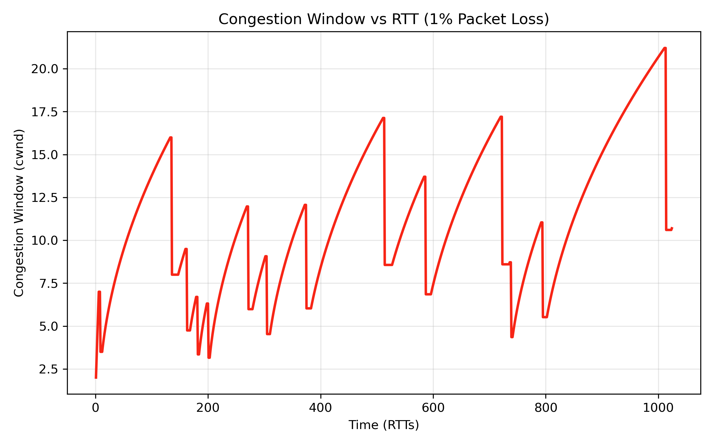
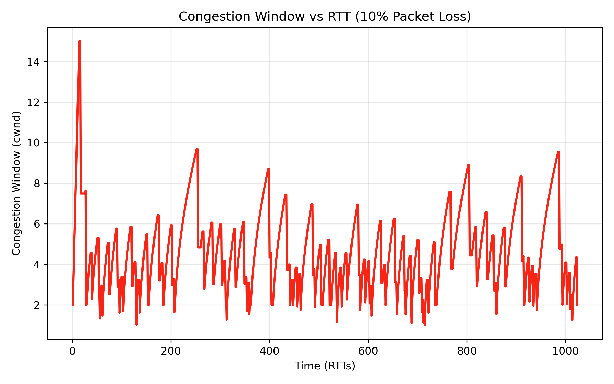
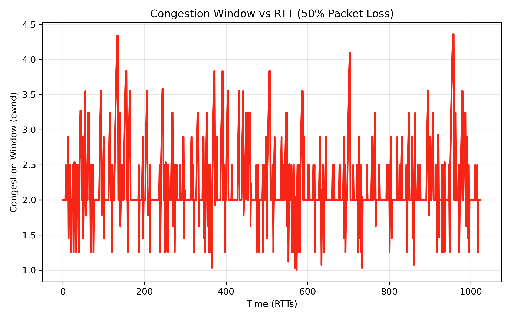
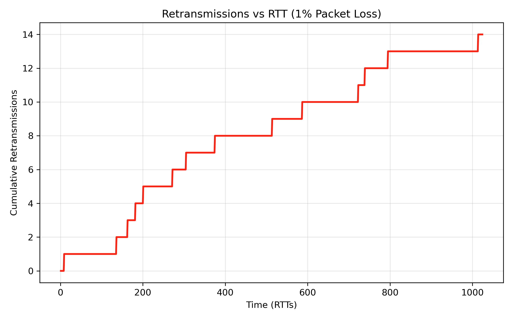
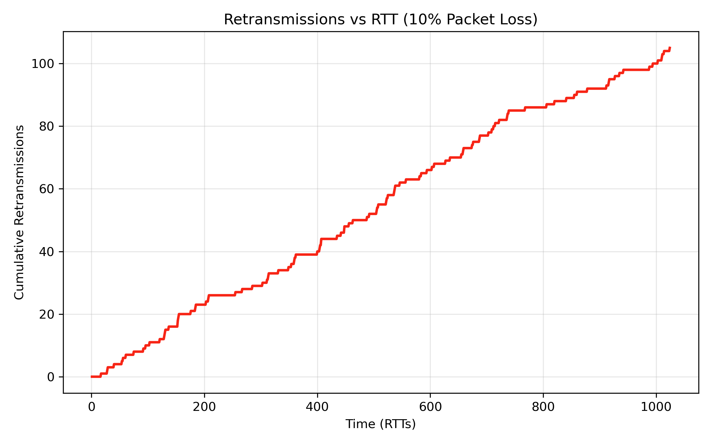
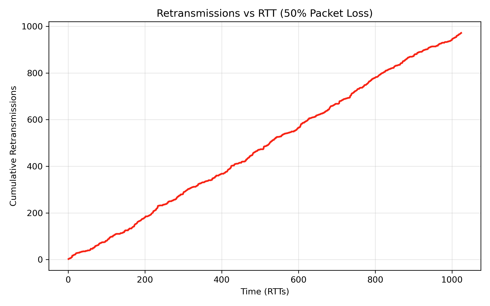

# CSC-364 Assignment 3: TCP over UDP

This project implements a simplified TCP-like reliable file transfer protocol over UDP.

## Files

- `tcp_client.py`: client implementation
- `tcp_server.py`: server implementation
- `gistfile1.txt`: input file
- `csc_364_assignment_3_report.pdf`: report
- `figures/`: graphs and plotting notebook
- `data/`: simulation CSV logs and received output file

## Run

Start the server first:

```bash
python3 tcp_server.py
```

Then run the client next:

```bash
python3 tcp_client.py
```

To verify that the transfer was all intact:
```bash
diff gistfile1.txt data/received.txt
```
Where no match means that the files are identical.

To generate the graphs at their respective losses, one can adjust the `loss_probability` variable inside of `tcp_server.py`. For easy reference, the below feature all required 6 graphs:

## Graphs

### Congestion Window vs RTT

**1% Packet Loss**



**10% Packet Loss**



**50% Packet Loss**



### Retransmissions vs RTT

**1% Packet Loss**



**10% Packet Loss**



**50% Packet Loss**

